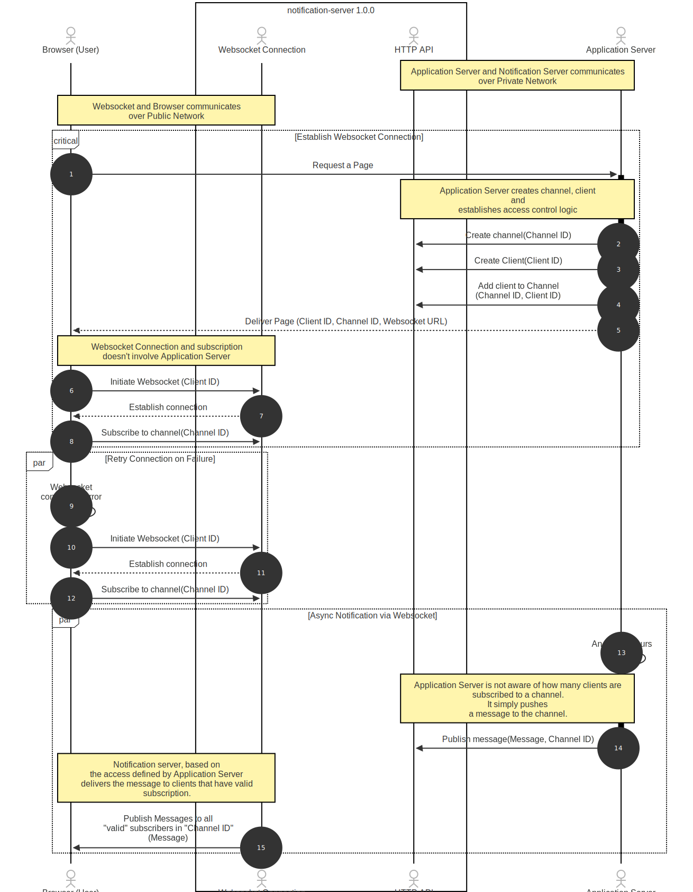

# Notification Server

A real-time notification server that provides secure WebSocket-based pub/sub functionality with HTTP-based access control.

## Features

- **Secure Client Management**
  - Client ID generation and validation
  - Client metadata support
  - Automatic client ID expiration

- **Channel Management**
  - Channel creation with access control rules
  - Channel access control (grant/revoke)
  - Maximum subscriber limits
  - Client pattern-based access rules

- **WebSocket Communication**
  - Real-time notifications
  - WebSocket-only subscription model
  - Connection status tracking
  - Automatic reconnection support

- **Access Control**
  - HTTP-based access management
  - Channel-level access control
  - Client-specific permissions
  - Access pattern validation

## Architecture

The system consists of two main components:

1. **HTTP API** (`openapi.yaml`)
   - Client management
   - Channel creation and access control
   - Notification publishing
   - History retrieval

2. **WebSocket API** (`asyncapi.yaml`)
   - Real-time notifications
   - Subscription management
   - Connection handling
   - Error reporting

## Setup

### Prerequisites

- Node.js (v16 or later)
- Redis (v6 or later)
- npm or yarn

### Installation

1. Clone the repository:
   ```bash
   git clone <repository-url>
   cd notification-server
   ```

2. Install dependencies:
   ```bash
   npm install
   ```

3. Configure environment variables:
   ```bash
   cp env.example .env
   # Edit .env with your configuration
   ```

4. Start Redis:
   ```bash
   redis-server
   ```

5. Start the server:
   ```bash
   npm start
   ```

## Testing

⚠️ **Important**: The test suite includes E2E tests that require a running server and Redis instance.

For development and testing, see the [Development > Running Tests](#running-tests) section for detailed setup instructions.

## API Documentation

### HTTP API

The HTTP API is documented in `openapi.yaml` and provides the following endpoints:

- **Client Management**
  - `POST /api/clients` - Generate a new client ID
  - `GET /api/clients/{clientId}` - Validate a client ID
  - `DELETE /api/clients/{clientId}` - Delete a client and all its data

- **Channel Management**
  - `POST /api/channels` - Create a new channel
  - `POST /api/channels/{channel}/access/{clientId}` - Grant channel access
  - `DELETE /api/channels/{channel}/access/{clientId}` - Revoke channel access

- **Notification Management**
  - `POST /api/notifications` - Publish a notification
  - `GET /api/notifications/{channel}` - Get notification history

### WebSocket API

The WebSocket API is documented in `asyncapi.yaml` and supports the following message types:

- **Connection Messages**
  ```json
  {
    "type": "connection",
    "clientId": "client123",
    "metadata": {
      "userAgent": "Demo Client",
      "environment": "development"
    }
  }
  ```

- **Subscription Messages**
  ```json
  {
    "type": "subscription",
    "action": "subscribe",
    "channel": "channel1"
  }
  ```

- **Notification Messages**
  ```json
  {
    "type": "notification",
    "data": {
      "channel": "channel1",
      "message": "Hello, world!",
      "timestamp": "2024-03-20T12:00:00Z",
      "metadata": {
        "priority": "high",
        "tags": ["important"]
      }
    }
  }
  ```

## Security

- Client IDs are required for WebSocket connections
- Channel access is controlled via HTTP API
- Client IDs expire after a configurable period
- Channel access can be revoked at any time
- Access patterns can be restricted using regex patterns
- **CORS Configuration**: Supports single or multiple allowed origins

## CORS Configuration

The server supports flexible CORS configuration for both HTTP API and WebSocket connections:

### **Single Origin**
```bash
CORS_ORIGIN=http://localhost:3000
```

### **Multiple Origins** (comma-separated)
```bash
CORS_ORIGIN=http://localhost:3000,https://app.example.com,https://admin.example.com
```

### **Allow All Origins** (default, use with caution in production)
```bash
CORS_ORIGIN=*
```

### **Environment Examples**

**Development**: Multiple local development servers
```bash
CORS_ORIGIN=http://localhost:3000,http://localhost:3001,http://localhost:8080
```

**Production**: Specific trusted domains
```bash
CORS_ORIGIN=https://app.yourcompany.com,https://admin.yourcompany.com
```

## Usage Example

1. Generate a client ID:
   ```bash
   curl -X POST http://localhost:3111/api/clients \
     -H "Content-Type: application/json" \
     -d '{"metadata": {"userAgent": "Demo Client"}}'
   ```

2. Create a channel:
   ```bash
   curl -X POST http://localhost:3111/api/channels \
     -H "Content-Type: application/json" \
     -d '{
       "channel": "demo",
       "rules": {
         "maxSubscribers": 100,
         "allowedClients": ["client123"],
         "allowedPatterns": ["client.*"]
       }
     }'
   ```

3. Connect via WebSocket:
   ```javascript
   const ws = new WebSocket('ws://localhost:8080?clientId=client123');
   
   ws.onmessage = (event) => {
     const data = JSON.parse(event.data);
     if (data.type === 'notification') {
       console.log('Received notification:', data.data);
     }
   };
   
   // Subscribe to a channel
   ws.send(JSON.stringify({
     type: 'subscription',
     action: 'subscribe',
     channel: 'demo'
   }));
   ```

## Development

### Running Tests

The project includes comprehensive E2E tests that require both the notification server and Redis to be running.

#### **Prerequisites for Testing**
- Redis server running on port 6379
- Notification server running on ports 3000 (HTTP) and 8080 (WebSocket)

#### **Option 1: Manual Test Setup**

1. **Start Redis:**
   ```bash
   # Using Docker
   docker run -d --name test-redis -p 6379:6379 redis:7-alpine
   
   # Or using local Redis installation
   redis-server
   ```

2. **Start the Notification Server:**
   ```bash
   # In a separate terminal
   PORT=3000 WS_PORT=8080 REDIS_URL=redis://localhost:6379 npm run dev
   ```

3. **Run Tests:**
   ```bash
   # In another terminal
   npm test
   ```

4. **Cleanup:**
   ```bash
   # Stop Redis container
   docker stop test-redis && docker rm test-redis
   
   # Stop the dev server (Ctrl+C in the dev terminal)
   ```

#### **Option 2: Test Script** (Coming Soon)
```bash
# Future enhancement - automated test setup
npm run test:e2e
```

#### **Test Types**
- **HTTP API E2E Tests**: Test all REST endpoints (25 tests)
- **WebSocket E2E Tests**: Test real-time functionality (5 tests)
- **CORS Configuration Tests**: Test multiple origin support (8 tests)

#### **Unit Tests Only**
To run only unit tests without E2E requirements:
```bash
# Run specific test files
npm test -- src/__tests__/cors.test.ts
```

### Linting

```bash
npm run lint
```

### Building

```bash
npm run build
```

## Contributing

1. Fork the repository
2. Create a feature branch
3. Commit your changes
4. Push to the branch
5. Create a Pull Request

## License

MIT License - see LICENSE file for details

## Channel Management

### Create Channel
```bash
curl -X POST http://localhost:3000/api/channels \
  -H "Content-Type: application/json" \
  -d '{
    "channel": "my-channel",
    "rules": {
      "isPublic": true,
      "allowedClientIds": ["client1", "client2"],
      "maxSubscribers": 100
    }
  }'
```

### Delete Channel
```bash
curl -X DELETE http://localhost:3000/api/channels/my-channel
```

### Error Handling
- Channel creation will fail with a 409 status if the channel already exists
- Channel deletion will fail with a 404 status if the channel doesn't exist
- Both operations require a valid channel name

### Client Management
```bash
# Generate a new client ID
curl -X POST http://localhost:3000/api/clients \
  -H "Content-Type: application/json" \
  -d '{"metadata": {"userAgent": "Demo Client"}}'

# Delete a client and all its data
curl -X DELETE http://localhost:3000/api/clients/client123
``` 

### Architecture

